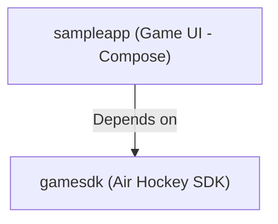
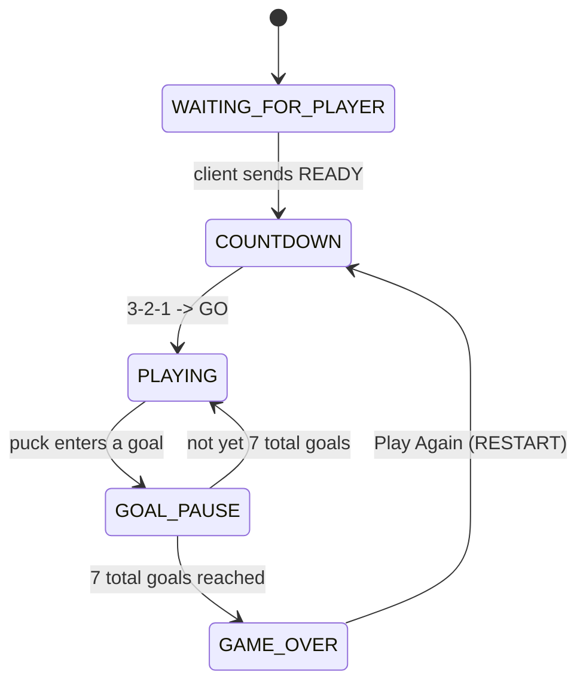
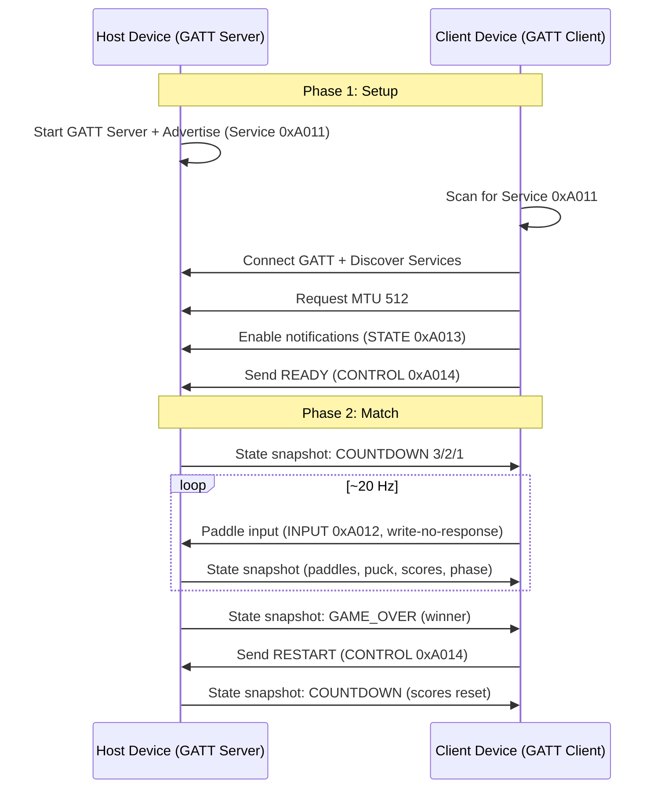

# Air Hockey over BLE

A two-player **Air Hockey** game played between two Android devices over Bluetooth Low Energy (BLE). One device hosts the game (runs the authoritative simulation and a GATT server), the other joins by scanning and connecting. The board, puck physics, scoring, and match state are all synchronized wirelessly in real time.

---

## 1. Project Architecture

Clean multi-module setup separating the reusable game SDK from the Compose app:



### Module Structure

*   `gamesdk/` (Public Android Library, package `com.client.bluehock.gamesdk`):
    *   **api/**: Public entry point (`GameSdk`) — `hostGame()`, `startScan()`, `connect()`, `sendPaddle()`, `restart()`, `observeState()`, `observeConnection()`, `observeErrors()`.
    *   **ble/**: `GameGattServer` (advertises + hosts the GATT service), `GameGattClient` (connects, subscribes to state snapshots, sends throttled paddle input), `GameScanner`.
    *   **engine/**: `AirHockeyEngine` — deterministic 120&nbsp;Hz physics simulation (paddle momentum, wall bounces, goal detection).
    *   **protocol/**: `GameProtocol` — compact little-endian binary (de)serialization for state snapshots, paddle input and control messages.
    *   **model/**: `GameConstants`, `GameRole`, `GamePhase`, `GameConnectionState`, `GameDeviceInfo`, `AirHockeyState`.
*   `sampleapp/` (Game App, package `com.client.bluehock`):
    *   `AirHockeyActivity` (launcher) handling BLE runtime permissions.
    *   `AirHockeyViewModel` bridging the UI to `GameSdk`.
    *   **ui/** Jetpack Compose screen (scalable, feature-split layout):
        *   `AirHockeyScreen` — screen orchestration: score header, board, phase overlays and connection controls.
        *   **board/**: `AirHockeyBoard` (drag input + per-frame canvas rendering), `BoardRenderer` (paddle / puck / goal-net drawing primitives), `BoardInterpolator` (snapshot smoothing), `BoardColors` (table and paddle palette).
        *   **components/**: `ScoreHeader`, `PhaseOverlay` (waiting / countdown / winner), `ControlBar` (host / find / join / disconnect).
        *   **theme/**: Material theme, typography and colors.

---

## 2. Gameplay & Rules

*   Two players, two devices: the **host** controls the bottom (red) paddle, the **client** the top (blue) paddle.
*   The match runs until **7 goals are scored in total**. The player with the **most goals** is declared the winner.
*   Every goal triggers a short pause, then the puck is re-centred for the next serve.
*   After the winner screen, either player can tap **Play Again** to reset scores and restart with a fresh 3-2-1 countdown.

### Match flow



---

## 3. BLE Communication & Protocol

The host is authoritative: it runs the simulation, detects goals, and streams state snapshots to the client at ~20&nbsp;Hz. The client only sends its paddle position and control messages upstream.



### GATT service

| Element | UUID | Purpose |
| --- | --- | --- |
| Air Hockey Service | `0000A011-0000-1000-8000-00805f9b34fb` | Game service |
| INPUT Characteristic | `0000A012-0000-1000-8000-00805f9b34fb` | Client paddle position (write / write-no-response) |
| STATE Characteristic | `0000A013-0000-1000-8000-00805f9b34fb` | Host state snapshots (notify) |
| CONTROL Characteristic | `0000A014-0000-1000-8000-00805f9b34fb` | Control messages — READY (`0x01`), RESTART (`0x02`) (write + notify) |
| CCCD | `00002902-0000-1000-8000-00805f9b34fb` | Notification subscription |

All messages are little-endian binary. The 22-byte state snapshot encodes the game phase, countdown, both scores, winner, both paddle positions, puck position/velocity (scaled by 10), and the target goal count.

---

## 4. How to Test

Requires **two Android devices** with Bluetooth (BLE).

1. Build and install the **sampleapp** on both devices.
2. Grant Bluetooth, Location (and advertising on Android 12+) permissions.
3. On **Device 1** tap **Host Game** — it starts advertising and waits.
4. On **Device 2** tap **Find Game**, select the discovered host, then **Join**.
5. The countdown starts automatically; drag your half of the board to move your paddle.
6. Play until **7 total goals**; the winner screen appears, then either player taps **Play Again**.

### Build

```bash
./gradlew :sampleapp:assembleDebug
```

Install the produced APK:

```bash
./gradlew :sampleapp:installDebug
```

### Tests

The SDK contains unit tests for the binary protocol (round-trip encoding) and the physics engine (goal detection and wall bounces):

```bash
./gradlew :gamesdk:testDebugUnitTest
```

---

## 5. Roadmap & Extensions

*   **Client-side input prediction**: render the client's own paddle from local drag data and blend with authoritative snapshots (already partially done in the UI) to reduce perceived latency.
*   **Latency tuning**: adaptive snapshot rate, MTU negotiation and connection parameters (intervals/supervision timeout) tuned per device class.
*   **Powerups / variants**: extend the state snapshot with extra gameplay fields without breaking older clients (protocol versioning).
*   **Real-time fairness**: add clock-sync / sequence numbers to snapshots to detect and smooth dropped packets.
*   **Matchmaking**: a simple lobby service so a host can name a room and clients join by name instead of scanning.
